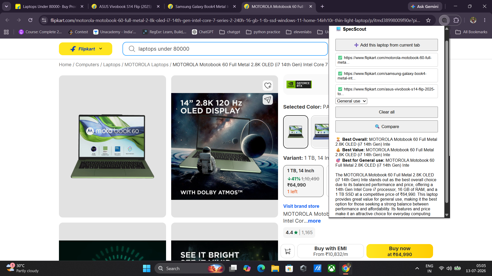

# 🔍 SpecScout — AI Laptop Comparison Agent

SpecScout is an AI agent that compares laptops for you — from a web app, or
directly from your browser while shopping. Add laptops by URL (or paste raw
specs), pick your use case, and get a structured comparison table plus an
AI-generated verdict tailored to what actually matters for that use case.

## Demo

**Streamlit app — paste specs or URLs, compare up to 3 laptops:**


**Comparison output — table + AI verdict:**


**Browser extension — add laptops straight from Flipkart tabs, compare in the popup:**



Example: three real laptops — Motorola Motobook 60 (2.8K OLED, i7 14th Gen),
Samsung Galaxy Book4 Metal, and ASUS Vivobook S14 Flip — each added directly
from its own open Flipkart tab with a single click. SpecScout's backend
fetched all three listings server-side, extracted specs, and returned a
verdict right inside the popup: the Motorola Motobook 60 as best overall for
"General use," with reasoning that weighs its 14th Gen i7, 16GB RAM, and 1TB
SSD against its ₹64,990 price — not just picking the most powerful or the
cheapest laptop in isolation.

## What it does

**Two ways to use SpecScout, same AI engine underneath:**

1. **Web app (Streamlit)** — add 2–3 laptops by pasting a product URL or raw
   spec text, select a use case, get a full comparison table + verdict
2. **Browser extension (Chrome)** — while browsing Flipkart, click "Add this
   laptop from current tab" on each product page you're considering, then
   compare them from the extension popup without leaving your browsing flow

Both paths use the same reasoning: an LLM (Llama 3.3 70B via Groq) evaluates
laptops against criteria specific to the selected use case — e.g. for Gaming
it weighs GPU/refresh rate, for Coding it weighs RAM/battery life, for
Student it weighs weight/portability/price — rather than just picking
whichever laptop has the biggest number on any single spec.

## Tech stack

- **Python** — core logic and both server implementations
- **Streamlit** — web app UI
- **FastAPI + Uvicorn** — backend API for the browser extension
- **Groq API (Llama 3.3 70B)** — LLM reasoning and structured JSON output
- **Requests + BeautifulSoup** — server-side page fetching and spec extraction
- **Chrome Extension (Manifest V3)** — browser-based UI, calls the backend directly
- **python-dotenv** — API key management

## Project structure

```
SpecScout/
├── app.py                  # Streamlit web app
├── core.py                 # Shared logic: prompt building, LLM calls,
│                            # URL fetching — used by both app.py and the backend
├── backend/
│   └── server.py            # FastAPI backend the extension talks to
└── extension/
    ├── manifest.json         # Chrome extension config
    ├── popup.html              # Extension popup UI
    └── popup.js                 # Extension popup logic
                                  # (no content script needed — the popup
                                  #  reads the active tab's URL directly)
```

## Setup

### 1. Get a free Groq API key
[console.groq.com/keys](https://console.groq.com/keys)

### 2. Clone and install
```bash
git clone https://github.com/Durgesh83kumar/SpecScout.git
cd SpecScout
python -m venv venv
source venv/bin/activate      # Windows: venv\Scripts\activate
pip install -r requirements.txt
```

### 3. Add your API key
```
# .env
GROQ_API_KEY=your_key_here
```

### 4. Run the web app
```bash
streamlit run app.py
```

### 5. Run the backend (needed for the browser extension)
```bash
uvicorn backend.server:app --reload --port 8000
```

### 6. Load the browser extension
1. Open Chrome → `chrome://extensions`
2. Enable **Developer mode** (top right)
3. Click **Load unpacked** → select the `extension/` folder
4. Visit a Flipkart laptop page → click the SpecScout icon → **Add this
   laptop from current tab**
5. Repeat on a second (and optional third) laptop page
6. Pick a use case → **Compare**

The backend (step 5) must be running for the extension to work.

## How it works (architecture)

```
                    ┌─────────────────┐
                    │     core.py      │
                    │ fetch_specs_from_url()
                    │ build_prompt()    │
                    │ get_comparison()   │
                    └───────┬─────────┘
                            │
              ┌─────────────┴─────────────┐
              │                             │
      ┌───────▼───────┐           ┌────────▼────────┐
      │   app.py        │           │ backend/server.py │
      │  (Streamlit)     │           │    (FastAPI)        │
      └───────┬───────┘           └────────┬────────┘
              │                             │
      User pastes specs/URL         Browser extension sends
      directly in the browser       the current tab's URL
```

**Extension flow specifically:**
```
User clicks "Add this laptop from current tab" on a Flipkart tab
        │
        ▼
Popup reads the active tab's URL directly via chrome.tabs.query
(no content script, no in-browser DOM scraping)
        │
        ▼
On "Compare": extension POSTs collected URLs + use case to
http://127.0.0.1:8000/compare-urls
        │
        ▼
Backend fetches each URL server-side (requests + BeautifulSoup),
extracts product name + specs
        │
        ▼
Backend builds a use-case-aware prompt and calls Groq (Llama 3.3 70B)
        │
        ▼
Structured JSON (table + verdict + summary) returned to the popup
```

This is a genuinely agentic pipeline: the extension and backend fetch live
external data and reason over it autonomously, rather than only processing
text a user hands over directly.

## Project status

✅ **Phase 1 — Complete**
Manual spec paste → AI comparison, structured table + verdict.

✅ **Phase 2 — Complete**
Paste a product URL instead of specs — the Streamlit app fetches and
extracts specs and product names automatically. Use-case-aware evaluation
criteria added, verdict/summary consistency enforced, robust JSON parsing.

✅ **Phase 3 — Complete**
- Chrome extension (Manifest V3) lets you add laptops directly from
  Flipkart product pages and compare them without leaving the browser
- Shared `core.py` module used by both the Streamlit app and a new FastAPI
  backend, avoiding duplicated logic
- Extension sends tab URLs to the backend, which does the actual page
  fetching server-side — more reliable than in-browser DOM scraping, since
  it reuses the exact fetch/parse logic already proven in Phase 2
- Verdict logic tightened further: "best overall" now explicitly factors in
  price rather than pure specs, and each verdict field is constrained to
  always contain a laptop name (fixing an earlier bug where a field
  occasionally echoed the use case label instead)
- Tested end-to-end across multiple real Flipkart listings and use cases

🔜 **Phase 4 — Planned**
Generalize beyond laptops to other electronics categories (phones,
earbuds, monitors, etc.), and extend the extension/backend to other retail
sites beyond Flipkart.

## Known limitations

- Spec extraction quality depends on how a listing's page is structured;
  fields a seller omits (e.g. battery life) are reported honestly as "Not
  listed by seller" rather than guessed
- The backend must be running locally for the extension to work — this is
  a local-first prototype, not yet deployed to a public server
- Currently scoped to Flipkart; other retailers would need their own page
  parsing adjustments in `fetch_specs_from_url`

## Notes

- `.env` is excluded via `.gitignore`; never commit API keys
- The extension fetches pages server-side via the backend rather than
  scraping the live rendered DOM in-browser — this sidesteps issues with
  sites that lazy-load or tab-switch content client-side