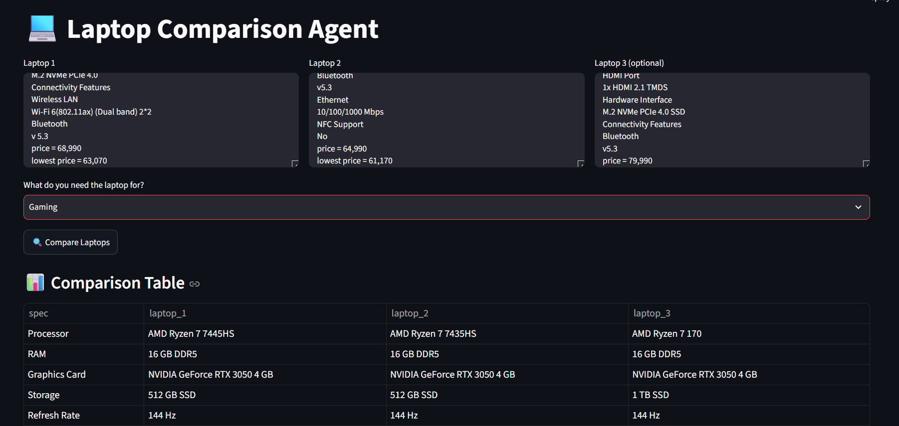
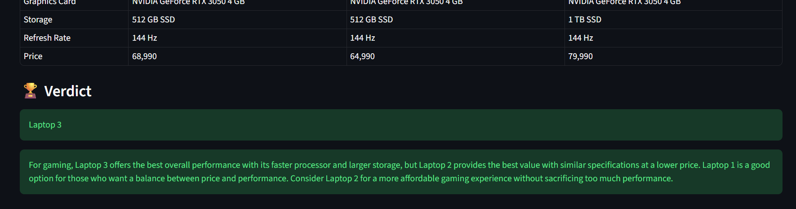

# 🔍 SpecScout — AI Laptop Comparison Agent

SpecScout is an AI-powered tool that compares laptops based on raw specification
text. Paste in specs from any listing (Flipkart, Amazon, etc.), and it returns a
structured comparison table plus an AI-generated verdict tailored to your use case.

## Demo

**Input — paste specs for up to 3 laptops:**



**Output — comparison table + AI verdict:**



Example run: three gaming laptops (Ryzen 7 / RTX 3050 class) compared for the
"Gaming" use case. SpecScout correctly identified the laptop with the larger
1TB SSD as best overall, while flagging a cheaper, similarly-specced option as
the best value pick — reasoning drawn directly from the pasted specs, not
hardcoded rules.

## What it does

1. You paste raw spec text for 2–3 laptops (copy-pasted straight from a
   product listing — no formatting required)
2. You select your use case (Gaming, Coding, Student, Business, etc.)
3. An LLM (Llama 3.3 70B via Groq) parses the specs and returns:
   - A clean side-by-side comparison table (Processor, RAM, Storage, GPU,
     Display, Battery, Price, etc.)
   - A verdict: best overall, best value, and best for your specific use case
   - A plain-language summary explaining the recommendation

## Tech stack

- **Python**
- **Streamlit** — UI
- **Groq API (Llama 3.3 70B)** — LLM reasoning and structured JSON output
- **python-dotenv** — API key management

## Setup

1. Get a free Groq API key from [console.groq.com/keys](https://console.groq.com/keys)

2. Clone the repo and install dependencies:
   ```bash
   git clone https://github.com/Durgesh83kumar/SpecScout.git
   cd SpecScout
   python -m venv venv
   source venv/bin/activate      # Windows: venv\Scripts\activate
   pip install -r requirements.txt
   ```

3. Add your API key to a `.env` file:
   ```
   GROQ_API_KEY=your_key_here
   ```

4. Run the app:
   ```bash
   streamlit run app.py
   ```

## How it works (architecture)

```
User pastes specs (2-3 laptops) + selects use case
              │
              ▼
   Prompt builder constructs a structured prompt
              │
              ▼
      Groq API (Llama 3.3 70B) generates JSON:
      comparison table + verdict + summary
              │
              ▼
   Streamlit renders table, verdict, and summary
```

## Project status

✅ **Phase 1 — Complete**
- Manual spec paste → AI comparison pipeline working end-to-end
- Tested with 3 real laptops from Flipkart listings
- Structured JSON output rendered as table + verdict

🔜 **Phase 2 — Planned**
- Paste a product URL instead of manually copying specs; the app fetches
  and extracts specs automatically
- Moves the project from pure Gen AI (single input → output) toward an
  agentic pipeline (fetch → extract → reason)

🔜 **Phase 3 — Planned**
- Browser extension with a "Compare with AI" button on product pages

🔜 **Phase 4 — Planned**
- Generalize beyond laptops to other electronics categories

## Notes

- This project does not scrape any website — specs are manually pasted by
  the user, so there are no ToS concerns with sites like Flipkart.
- `.env` is excluded via `.gitignore`; never commit API keys.